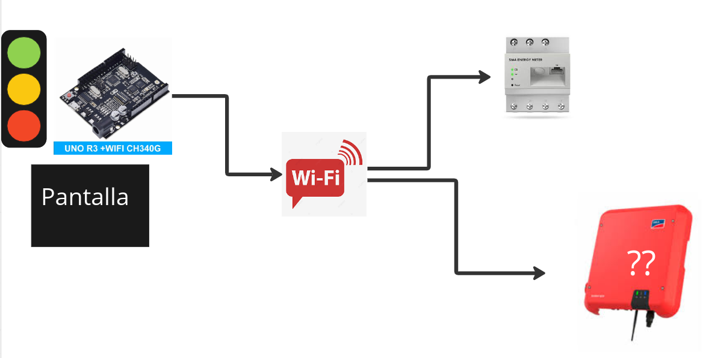
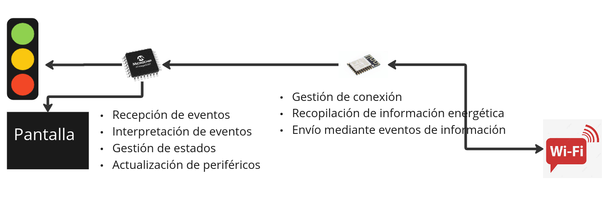
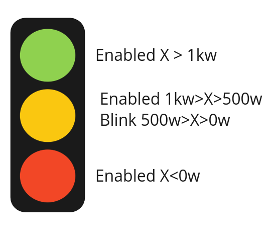

# SMA Meter Traffic Light

This project is a life traffic to indicate the energetic balance of a house with a SMA installation.

## Beerware licensed
As long as you retain this notice you can do whatever you want with this stuff. If we meet some day, and you think 
this stuff is worth it, you can buy me a beer in return.

## Hardware needed
I did the project using a UNO R3 MEGA328P to control the traffic light and an ESP8266 for the wireless communication.

## Overview

## Traffic Light Logic

## Next Steps
This is the roadmap for the project:
- Add a how to install it in your hardware.
- Renew the SMA Meter Token every X time.
- Add conections diagram.
- Use a OLED display to show information.
- See the information we can get from the SMA inverter.